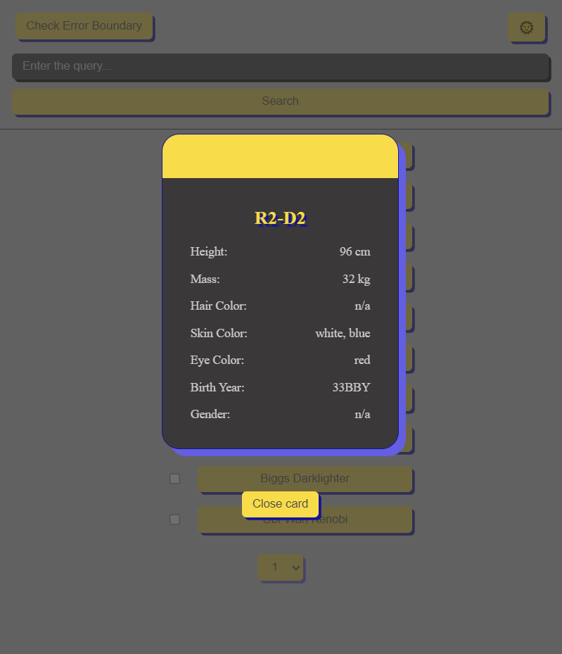
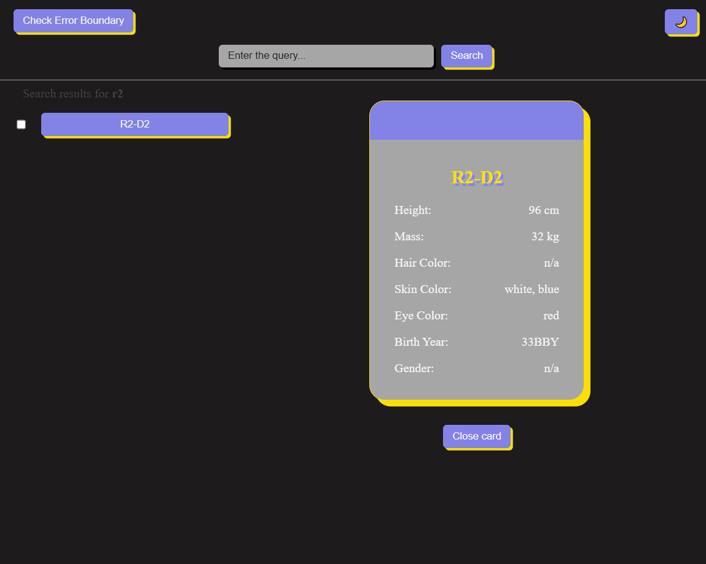
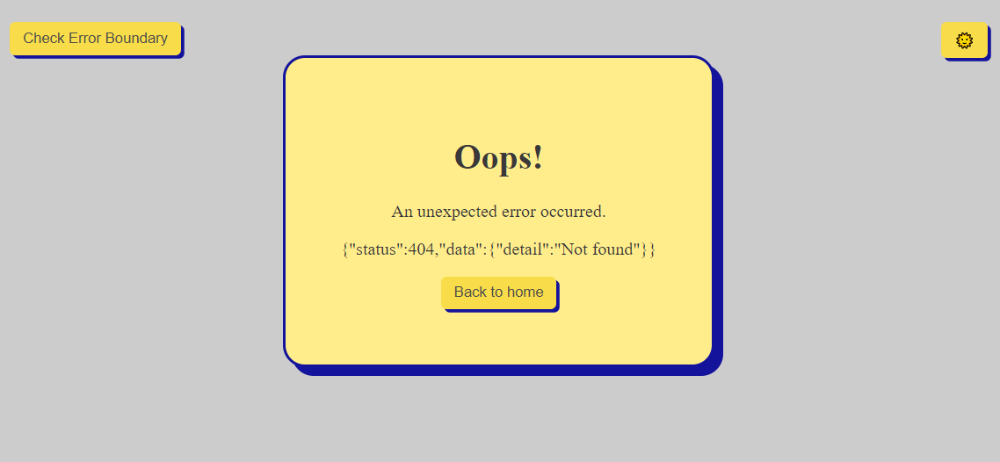
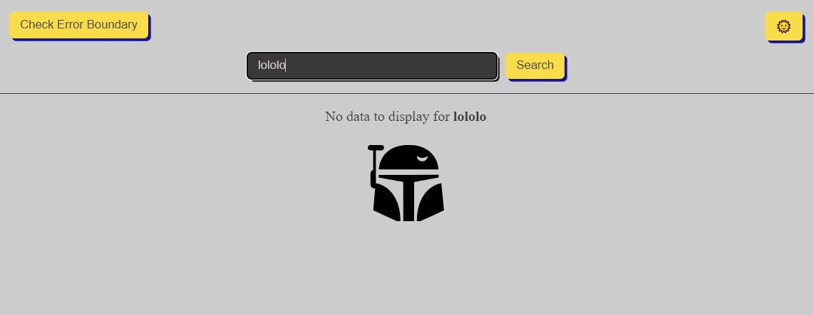

# Star Wars API Project Documentation

## Project Overview

This project is a React application built with Next.js for server-side rendering and fast development processes. It uses TypeScript for type safety, Redux and Redux Toolkit Query (RTK Query) for data fetching and state management, and Next.js Pages API for navigation and routing. The application interacts with the Star Wars API (SWAPI) to fetch and display information about Star Wars characters.

## Scripts

- **dev**: Starts the development server using Vite.
- **build**: Compiles TypeScript and builds the application using Vite.
- **lint**: Runs ESLint on the ./src/ directory.
- **lint:fix**: Runs ESLint with the --fix flag on the ./src/ directory.
- **preview**: Previews the production build locally.
- **format**: Formats the codebase using Prettier.
- **format:fix**: Formats the codebase and additional files using Prettier.
- **precommit**: Runs format and lint scripts before committing changes.
- **prepare**: Husky hook installation script.
- **test**: Run tests.
- **coverage**: Provide coverage report from v8.

## Running the Project

- Install Dependencies:

npm install

- Start Development Server:

npm run dev

## Usage

The application fetches data from the Star Wars API and displays information about characters, including their name, height, mass, and other attributes. Users can navigate through different characters using React Router.

## Screenshots

## About me

I am [Natalia Ivantsova](https://github.com/NataliaIv90), a Front-End Developer from Ukraine, passionate about creating intuitive and dynamic user interfaces. This project was developed as part of a [React course at RSSchool](https://rs.school/courses/reactjs).
